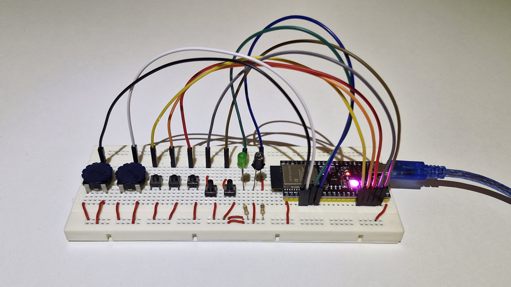
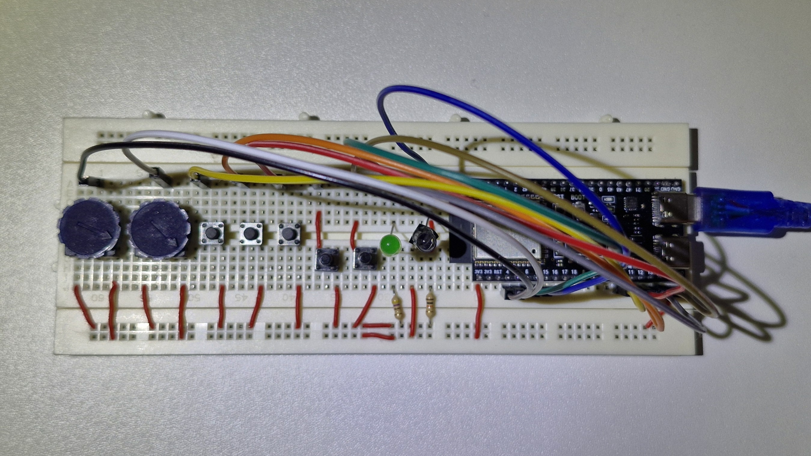
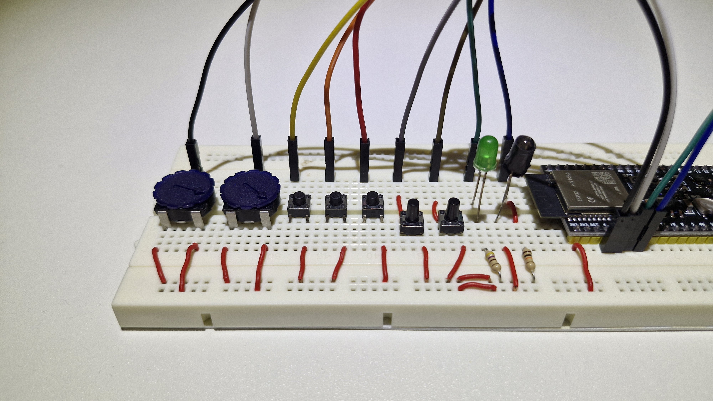
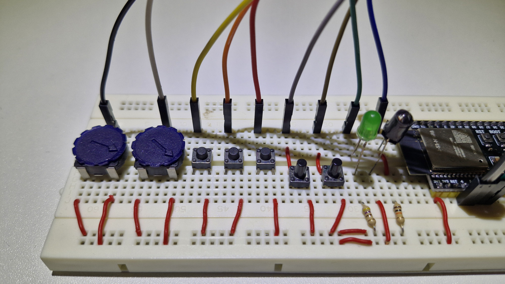
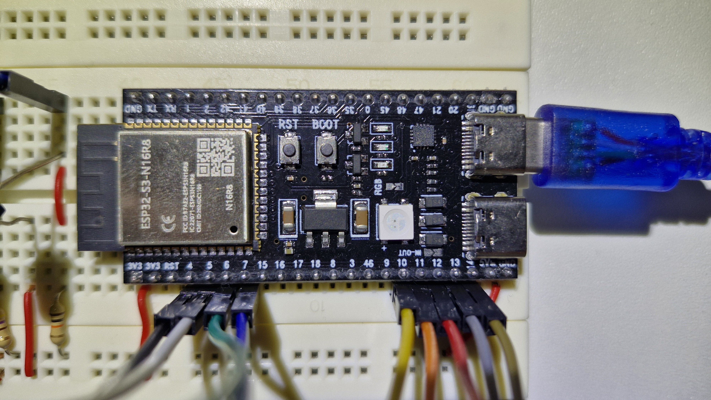

# ESP32-S3 RGB LED Controller

A feature-rich WS2812B LED controller built on the ESP32-S3, supporting rainbow cycling, disco mode, night mode with LDR-based auto-brightness, and full serial/button/potentiometer control.

---

## Hardware Overview



---

## Assembly

### Top View


### Breadboard Connections


### Wiring Detail


### ESP32-S3 Pinout Reference


---

## Pin Mapping

| Component         | Pin  | Notes                        |
|-------------------|------|------------------------------|
| WS2812B LED Data  | 48   | Single RGB LED (GRB order)   |
| Status LED        | 6    | PWM-controlled indicator     |
| Button 1          | 10   | Cycle static colors          |
| Button 2          | 11   | Disco mode trigger           |
| Button 3          | 12   | Power toggle                 |
| Button 4          | 13   | Toggle rainbow mode          |
| Button 5          | 14   | Toggle night mode            |
| Potentiometer 1   | 4    | Speed control                |
| Potentiometer 2   | 5    | Brightness control           |
| LDR (Light sensor)| 7    | Auto-brightness in night mode|

---

## Features

### Modes
| Mode         | Description                                                                 |
|--------------|-----------------------------------------------------------------------------|
| Rainbow      | Continuously cycles through all hues. Speed controlled by Pot 1.           |
| Disco        | Jumps to a random hue and brightness. Trigger rate scales with speed.      |
| Night Mode   | Reads the LDR and adjusts brightness automatically based on ambient light. |
| Static Color | Displays a fixed color (Red, Green, Blue, or White).                       |

### Controls

**Buttons**

| Button | Function                                       |
|--------|------------------------------------------------|
| 1      | Cycle static colors: Red → Green → Blue → White|
| 2      | Trigger a random disco color                   |
| 3      | Power on / off (with fade animation)           |
| 4      | Toggle rainbow mode on / off                   |
| 5      | Toggle night mode on / off                     |

**Potentiometers**

| Pot | Function                                                    |
|-----|-------------------------------------------------------------|
| 1   | Speed (0.01 – 10.0). Affects rainbow cycle and disco rate. |
| 2   | Brightness (0 – 255). Disabled during disco or night mode. |

Potentiometers use a **lock/unlock** mechanism: if a value was set via serial or button, the pot is locked until it is physically moved by more than 100 ADC units, preventing sudden jumps.

**Status LED**

- **Short flash (30 ms):** Any action was triggered.
- **Slow heartbeat (200 ms on / 10 s off):** System is idle and running normally.
- **Solid on (1 s):** System is powering off.

---

## Serial Console

Connect at **921600 baud**. Commands are single characters.

### System

| Command | Action             |
|---------|--------------------|
| `o`     | Power on / off     |
| `x`     | Reset all settings |
| `i`     | Toggle debug mode  |

### Modes

| Command | Action                      |
|---------|-----------------------------|
| `m`     | Toggle rainbow mode         |
| `d`     | Trigger random disco color  |
| `n`     | Toggle night mode           |

### Manual Colors

| Command | Color |
|---------|-------|
| `r`     | Red   |
| `g`     | Green |
| `b`     | Blue  |
| `w`     | White |

### Adjustments

| Command | Action                    |
|---------|---------------------------|
| `+`     | Increase brightness by 10 |
| `-`     | Decrease brightness by 10 |
| `f`     | Increase speed by 0.05    |
| `s`     | Decrease speed by 0.05    |

> **Note:** Brightness commands are blocked while night mode is active.

### Debug Mode (`i`)

When enabled, a compact status line is printed every loop iteration:

```
MS:  123456 | ON:Y | MODE:R.. | SPD: 1.00 | MBR:127 | BR:127 | P1: 512(.) | P2:1024(.) | LDR: 300 | RGB:128, 64,255 | ACT:.
```

---

## Getting Started

### Requirements

- [PlatformIO](https://platformio.org/) (CLI or VS Code extension)
- ESP32-S3 DevKitC-1 board
- FastLED library (automatically fetched via `platformio.ini`)

### Build & Flash

```bash
pio run --target upload
```

### Open Serial Monitor

```bash
pio device monitor
```

---

## Dependencies

| Library  | Version  | Source                          |
|----------|----------|---------------------------------|
| FastLED  | ^3.6.0   | https://github.com/FastLED/FastLED |

---

## Project Structure

```
├── src/
│   └── main.cpp          # Main firmware
├── images/               # Hardware photos
├── include/              # Header files (currently unused)
├── lib/                  # Private libraries (currently unused)
├── test/                 # PlatformIO unit tests
└── platformio.ini        # Build configuration
```
